---
name: AORO MVP Implementation
overview: Build a production-grade Autonomous Outcome-Based Revenue Orchestrator MVP covering the Signal Engine (lead discovery), Multi-Agent Workflow (LangGraph), and ServiceTitan CRM integration via MCP, targeting the Commercial Fire Safety vertical.
todos:
  - id: project-setup
    content: Initialize project structure with Poetry, configure environment, and set up Docker Compose for local Neo4j/services
    status: completed
  - id: signal-engine-scrapers
    content: Build permit scraper framework with base class, implement first municipal portal scraper (Playwright-based)
    status: completed
    dependencies:
      - project-setup
  - id: signal-engine-enrichment
    content: Implement data enrichment pipeline with Apollo/Clearbit integration for decision maker identification
    status: completed
    dependencies:
      - signal-engine-scrapers
  - id: knowledge-layer
    content: Set up Neo4j fire code graph schema and Pinecone vector index with case study embeddings
    status: completed
    dependencies:
      - project-setup
  - id: langgraph-orchestrator
    content: Build LangGraph state machine with Researcher, Communicator, and Closer agent nodes
    status: completed
    dependencies:
      - knowledge-layer
  - id: hitl-gates
    content: Implement Human-in-the-Loop approval gates using LangGraph interrupt mechanism
    status: completed
    dependencies:
      - langgraph-orchestrator
  - id: mcp-server
    content: Create FastMCP server exposing ServiceTitan CRM tools (bookings, availability, pricebook)
    status: completed
    dependencies:
      - langgraph-orchestrator
  - id: servicetitan-integration
    content: Build ServiceTitan API client with OAuth authentication and multi-tenant security
    status: completed
    dependencies:
      - mcp-server
  - id: observability
    content: Integrate LangSmith for workflow tracing and decision audit trails
    status: completed
    dependencies:
      - langgraph-orchestrator
  - id: api-layer
    content: Build FastAPI application with routes for lead ingestion, agent triggering, and webhooks
    status: completed
    dependencies:
      - mcp-server
      - signal-engine-enrichment
---

# AORO MVP Master Implementation Plan

**Last Updated:** January 13, 2026  
**Overall Progress:** ~85% Complete (Phase 1 & 2 Complete, Phase 3 Pending)

## 📊 Current Status Summary

### ✅ Completed Phases
- **Phase 1.1:** Permit Scraper Framework ✅ (2 municipalities, 500+ permits)
- **Phase 1.2:** Regulatory Listener ✅ (EPA, NFPA, Fire Marshal feeds)
- **Phase 1.3:** Data Enrichment Pipeline ✅ (Apollo + Hunter.io hybrid)
- **Phase 2:** Agentic Workflow ✅ (Complete LangGraph workflow with all nodes)

### ⏳ Pending Phases
- **Phase 3:** MCP Integration ⏳ (ServiceTitan CRM integration)
- **Phase 1.4:** Permit Discovery Expansion ⏳ (Scale to 50+ cities - planned)

### 📈 Key Achievements
- ✅ End-to-end workflow from permit discovery to outreach
- ✅ Real permit scraping from 2 municipalities
- ✅ Complete agent workflow with response handling
- ✅ Workflow monitoring and observability
- ✅ Tested with real permits end-to-end

### 🎯 Next Priorities
1. **Phase 3:** Complete MCP integration for ServiceTitan CRM
2. **Phase 1.4:** Scale permit discovery to 50+ cities (free methods)

---

## System Architecture Overview

```mermaid
flowchart TB
    subgraph SignalEngine [Phase 1: Signal Engine ✅]
        PS[Permit Scrapers ✅]
        RL[Regulatory Listener ✅]
        DE[Data Enrichment ✅]
        PD[Portal Discovery ⏳]
        PS --> DE
        RL --> DE
        PD --> PS
    end

    subgraph KnowledgeLayer [Knowledge Layer]
        Neo4j[(Neo4j Graph DB)]
        Pinecone[(Pinecone Vector DB)]
    end

    subgraph AgentWorkflow [Phase 2: Agent Workflow]
        Orchestrator[LangGraph Orchestrator]
        ResearchAgent[Researcher Agent]
        CommAgent[Communication Agent]
        CloserAgent[Closer Agent]
        Orchestrator --> ResearchAgent
        Orchestrator --> CommAgent
        Orchestrator --> CloserAgent
    end

    subgraph IntegrationLayer [Phase 3: MCP Integration]
        MCPServer[FastMCP Server]
        ServiceTitan[ServiceTitan API]
        Calendar[Calendar Sync]
        MCPServer --> ServiceTitan
        MCPServer --> Calendar
    end

    DE --> Neo4j
    DE --> Pinecone
    ResearchAgent --> Neo4j
    ResearchAgent --> Pinecone
    CommAgent --> MCPServer
    CloserAgent --> MCPServer
```



---

## Project Structure

```javascript
AI_Agent_Leads_Revenue/
├── pyproject.toml                 # Project dependencies (Poetry/UV)
├── .env.example                   # Environment template
├── README.md
├── docker-compose.yml             # Local dev services
│
├── src/
│   ├── __init__.py
│   │
│   ├── signal_engine/             # Phase 1: Lead Discovery
│   │   ├── __init__.py
│   │   ├── scrapers/
│   │   │   ├── base_scraper.py    # Abstract scraper interface
│   │   │   ├── permit_scraper.py  # Municipal permit monitoring
│   │   │   └── regulatory_scraper.py
│   │   ├── enrichment/
│   │   │   ├── apollo_client.py   # Contact enrichment
│   │   │   └── company_enricher.py
│   │   ├── listeners/
│   │   │   └── fire_marshal_listener.py
│   │   └── models.py              # Pydantic models for leads
│   │
│   ├── knowledge/                 # Knowledge Layer
│   │   ├── __init__.py
│   │   ├── graph/
│   │   │   ├── neo4j_client.py
│   │   │   ├── schemas.py         # Cypher schemas
│   │   │   └── fire_code_graph.py # NFPA regulatory graph
│   │   └── vectors/
│   │       ├── pinecone_client.py
│   │       └── embeddings.py
│   │
│   ├── agents/                    # Phase 2: LangGraph Agents
│   │   ├── __init__.py
│   │   ├── orchestrator.py        # Main LangGraph workflow
│   │   ├── state.py               # Shared agent state schema
│   │   ├── nodes/
│   │   │   ├── researcher.py      # Prospect analysis
│   │   │   ├── communicator.py    # Outreach generation
│   │   │   ├── closer.py          # Objection handling
│   │   │   └── human_review.py    # HITL approval gate
│   │   └── tools/
│   │       ├── regulatory_lookup.py
│   │       ├── case_study_search.py
│   │       └── contact_finder.py
│   │
│   ├── integrations/              # Phase 3: MCP + External APIs
│   │   ├── __init__.py
│   │   ├── mcp/
│   │   │   ├── server.py          # FastMCP server definition
│   │   │   ├── tools/
│   │   │   │   ├── crm_tools.py   # ServiceTitan CRM tools
│   │   │   │   ├── calendar_tools.py
│   │   │   │   └── pricebook_tools.py
│   │   │   └── auth.py            # Multi-tenant auth
│   │   └── servicetitan/
│   │       ├── client.py          # REST API wrapper
│   │       └── models.py
│   │
│   ├── core/                      # Shared utilities
│   │   ├── __init__.py
│   │   ├── config.py              # Settings management
│   │   ├── security.py            # RLS, encryption
│   │   └── observability.py       # LangSmith integration
│   │
│   └── api/                       # FastAPI application
│       ├── __init__.py
│       ├── main.py
│       └── routes/
│           ├── leads.py
│           ├── agents.py
│           └── webhooks.py
│
├── tests/
│   ├── unit/
│   ├── integration/
│   └── fixtures/
│
└── scripts/
    ├── seed_knowledge_graph.py
    └── run_scraper_job.py
```

---

## Phase 1: Signal Engine (Weeks 1-4) ✅ **COMPLETE**

### 1.1 Permit Scraper Framework ✅ **COMPLETE**

**Status:** ✅ 100% Complete  
**Achievement:** Successfully extracting permits from 2 municipalities (Mecklenburg County, San Antonio)

Build an async scraper system targeting municipal fire/mechanical permit portals.

**Key Components:**

- Abstract `BaseScraper` class with retry logic, rate limiting, and proxy rotation
- Playwright-based scraper for JavaScript-heavy portals
- Scheduled job runner using APScheduler or Celery Beat

**Target Data Points:**

- Permit number, type (Fire Alarm, Sprinkler, HVAC)
- Property address and building type
- Applicant/contractor information
- Status transitions ("Permit Issued", "Inspection Scheduled")

**Implementation Pattern:**

```python
# src/signal_engine/scrapers/base_scraper.py
from abc import ABC, abstractmethod
from pydantic import BaseModel

class PermitData(BaseModel):
    permit_id: str
    permit_type: str
    address: str
    building_type: str
    status: str
    applicant_name: str | None
    issued_date: datetime | None

class BaseScraper(ABC):
    @abstractmethod
    async def scrape(self) -> list[PermitData]: ...
    
    @abstractmethod
    async def check_for_updates(self, last_run: datetime) -> list[PermitData]: ...
```

### 1.2 Regulatory Listener ✅ **COMPLETE**

**Status:** ✅ 100% Complete  
**Achievement:** Monitoring EPA, NFPA, and State Fire Marshal RSS feeds

Monitor state fire marshal bulletins and federal register updates for compliance triggers.

**Data Sources:**

- State Fire Marshal RSS/API feeds
- NFPA code amendment announcements
- EPA refrigerant phase-out schedules (for future HVAC expansion)

### 1.3 Data Enrichment Pipeline ✅ **COMPLETE**

**Status:** ✅ 100% Complete  
**Achievement:** Hybrid Apollo + Hunter.io enrichment pipeline with credit safety

Cross-reference permit data with business intelligence APIs.

**Enrichment Flow:**


**Output Schema:**

- Company: name, industry, employee count, revenue estimate
- Decision Maker: name, title, email, LinkedIn, phone
- Compliance Context: applicable codes, inspection history

### 1.4 Permit Discovery Expansion ⏳ **PLANNED**

**Status:** ⏳ Planning  
**Goal:** Scale from 2 cities to 50+ cities using free methods  
**Timeline:** 8 weeks (can run parallel with Phase 3)

**Overview:**
This phase expands permit discovery coverage from the current 2 municipalities to 50+ cities nationwide using 100% free methods (Google Custom Search, open data APIs, standardized scrapers).

**Key Components:**

1. **Automated Portal Discovery**
   - Google Custom Search API integration (free tier: 100 queries/day)
   - Automatic discovery of municipal permit portals
   - Portal classification (Accela, ViewPoint, EnerGov, etc.)

2. **Scraper Standardization**
   - Reusable Accela scraper (100+ cities)
   - Reusable ViewPoint scraper (50+ cities)
   - Reusable EnerGov scraper (30+ cities)
   - Scraper registry/factory pattern

3. **Open Data API Integration**
   - Socrata API client (100+ cities)
   - CKAN API client (50+ cities)
   - Custom API clients for structured data

4. **Quality Filtering**
   - Permit quality scoring (0.0-1.0)
   - Pre-enrichment filtering (save credits)
   - Address validation

5. **Unified Ingestion Layer**
   - Single interface for all permit sources
   - Automated discovery scheduler
   - Portal configuration management

**Expected Outcomes:**
- 50+ municipalities with active permit sources
- 1,000+ permits/month discovered
- 70%+ permits with applicant names (quality)
- 60%+ enrichment efficiency (decision maker emails)
- $0/month cost (free methods only)

**Documentation:**
- Detailed plan: [`permit_discovery_expansion_plan.md`](permit_discovery_expansion_plan.md)
- Integration guide: [`permit_discovery_expansion_integration.md`](permit_discovery_expansion_integration.md)

---

## Phase 2: Agentic Workflow (Weeks 5-8) ✅ **COMPLETE**

**Status:** ✅ 100% Complete  
**Achievement:** Complete LangGraph workflow with all nodes, routing, and monitoring

### 2.1 LangGraph State Machine


### 2.2 Agent State Schema

```python
# src/agents/state.py
from typing import TypedDict, Literal
from langgraph.graph import MessagesState

class AOROState(TypedDict):
    # Lead Information
    lead_id: str
    company_name: str
    decision_maker: dict
    permit_data: dict
    
    # Research Results
    compliance_gaps: list[str]
    applicable_codes: list[str]
    case_studies: list[dict]
    
    # Communication State
    outreach_draft: str
    outreach_channel: Literal["email", "whatsapp", "voice"]
    response_history: list[dict]
    
    # Workflow State
    qualification_score: float
    current_objection: str | None
    human_approved: bool
    
    # CRM State
    crm_booking_id: str | None
    appointment_datetime: datetime | None
```

### 2.3 Agent Nodes

**Researcher Agent:**

- Queries Neo4j for applicable fire codes based on building type
- Searches Pinecone for relevant case studies
- Calculates "compliance urgency score"

**Communication Agent:**

- Generates hyper-personalized outreach using GPT-4o
- Leads with technical value: "Your {building_type} is subject to NFPA 72 2022 amendments..."
- Adapts tone based on decision maker title

**Closer Agent:**

- Fine-tuned prompt for handling domain-specific objections
- Access to local labor rate data and code citation lookup
- Negotiation patterns for high-ticket sales

### 2.4 Human-in-the-Loop Gates

```python
# src/agents/nodes/human_review.py
from langgraph.prebuilt import interrupt

def human_review_node(state: AOROState) -> AOROState:
    \"\"\"Pause workflow for human approval of outreach.\"\"\"
    if state[\"qualification_score\"] > 0.8:
        # Auto-approve high-confidence leads
        return {**state, \"human_approved\": True}
    
    # Interrupt for human review
    interrupt({
        \"type\": \"approval_required\",
        \"lead_id\": state[\"lead_id\"],
        \"draft\": state[\"outreach_draft\"],
        \"confidence\": state[\"qualification_score\"]
    })
```

---

## Phase 3: MCP Integration Layer (Weeks 9-12) ⏳ **PENDING**

**Status:** ⏳ Pending  
**Next Priority:** ServiceTitan CRM integration via MCP

### 3.1 FastMCP Server Architecture

```python
# src/integrations/mcp/server.py
from fastmcp import FastMCP

mcp = FastMCP(\"AORO ServiceTitan Bridge\")

@mcp.tool()
async def create_booking(
    customer_id: str,
    job_type: str,
    scheduled_datetime: str,
    notes: str,
    tenant_id: str  # Multi-tenancy
) -> dict:
    \"\"\"Create a new booking in ServiceTitan CRM.\"\"\"
    client = get_servicetitan_client(tenant_id)
    return await client.bookings.create(...)

@mcp.tool()
async def check_availability(
    technician_id: str,
    date_range: tuple[str, str],
    tenant_id: str
) -> list[dict]:
    \"\"\"Check technician availability slots.\"\"\"
    ...

@mcp.tool()
async def get_pricebook_services(
    category: str,
    tenant_id: str
) -> list[dict]:
    \"\"\"Retrieve service offerings and pricing.\"\"\"
    ...
```

### 3.2 ServiceTitan API Integration

**Required Endpoints:**

- `POST /bookings` - Create appointments
- `GET /customers` - Customer lookup
- `GET /pricebook/services` - Service catalog
- `GET /dispatch/technicians/availability` - Calendar availability

**Authentication:**

- OAuth 2.0 with tenant-specific credentials
- Secure credential storage in environment/vault

### 3.3 Multi-Tenant Security

```python
# src/core/security.py
from functools import wraps

def tenant_context(func):
    \"\"\"Decorator ensuring tenant isolation.\"\"\"
    @wraps(func)
    async def wrapper(*args, tenant_id: str, **kwargs):
        # Validate tenant access
        if not await verify_tenant_access(tenant_id):
            raise PermissionError(\"Invalid tenant context\")
        
        # Set row-level security context
        async with tenant_scoped_session(tenant_id):
            return await func(*args, tenant_id=tenant_id, **kwargs)
    return wrapper
```

---

## Knowledge Layer Setup

### Neo4j Fire Code Graph Schema

```cypher
// Core node types
CREATE CONSTRAINT FOR (c:FireCode) REQUIRE c.code_id IS UNIQUE;
CREATE CONSTRAINT FOR (b:BuildingType) REQUIRE b.type_id IS UNIQUE;
CREATE CONSTRAINT FOR (j:Jurisdiction) REQUIRE j.fips_code IS UNIQUE;

// Relationships
// (:FireCode)-[:APPLIES_TO]->(:BuildingType)
// (:Jurisdiction)-[:ENFORCES]->(:FireCode)
// (:FireCode)-[:SUPERSEDES]->(:FireCode)
// (:Inspection)-[:CITED]->(:Violation)-[:VIOLATES]->(:FireCode)
```

### Pinecone Index Configuration

- **Index Name:** `aoro-case-studies`
- **Dimensions:** 1536 (text-embedding-3-small)
- **Metadata Fields:** industry, deal_size, building_type, outcome
- **Namespace per tenant** for data isolation

---

## Observability with LangSmith

```python
# src/core/observability.py
from langsmith import traceable
from langsmith.wrappers import wrap_openai

# Wrap OpenAI client for automatic tracing
client = wrap_openai(OpenAI())

@traceable(name=\"researcher_agent\")
async def run_researcher(state: AOROState) -> AOROState:
    # All LLM calls automatically traced
    ...
```

**Tracked Metrics:**

- Lead-to-appointment conversion rate
- Agent decision audit trails
- Latency per workflow step
- Token usage and cost per lead

---

## Dependencies

```toml
# pyproject.toml (key dependencies)
[tool.poetry.dependencies]
python = \"^3.11\"
langgraph = \"^0.2\"
langchain-openai = \"^0.2\"
langsmith = \"^0.1\"
fastmcp = \"^0.1\"
neo4j = \"^5.0\"
pinecone-client = \"^3.0\"
fastapi = \"^0.115\"
uvicorn = \"^0.32\"
playwright = \"^1.48\"
pydantic = \"^2.0\"
httpx = \"^0.27\"
python-dotenv = \"^1.0\"
apscheduler = \"^3.10\"
```

---

## Implementation Status & Timeline

### Completed Phases ✅

| Phase | Timeline | Status | Achievement |
|------|----------|--------|-------------|
| **1.1 Permit Scraper Framework** | Weeks 1-2 | ✅ Complete | 2 municipalities, 500+ permits extracted |
| **1.2 Regulatory Listener** | Weeks 2-3 | ✅ Complete | EPA, NFPA, Fire Marshal feeds active |
| **1.3 Data Enrichment Pipeline** | Weeks 3-4 | ✅ Complete | Hybrid Apollo + Hunter.io working |
| **2.1-2.4 Agentic Workflow** | Weeks 5-8 | ✅ Complete | Full LangGraph workflow with all nodes |
| **2.1 Core Workflow** | Week 5-6 | ✅ Complete | Research, qualification, outreach generation |
| **2.2 Response Handling** | Week 6-7 | ✅ Complete | Response classification and routing |
| **2.3 Follow-ups & Objections** | Week 7-8 | ✅ Complete | Follow-up sequences, objection handling |
| **2.4 Testing & Monitoring** | Week 8 | ✅ Complete | End-to-end tests, workflow monitoring |

### Pending Phases ⏳

| Phase | Timeline | Status | Priority |
|------|----------|--------|----------|
| **3.1-3.3 MCP Integration** | Weeks 9-12 | ⏳ Pending | High - Complete MVP |
| **1.4 Permit Discovery Expansion** | Weeks 13-20 | ⏳ Planned | High - Scale to 50+ cities |

### Implementation Priority

**Immediate Next Steps:**
1. **Phase 3: MCP Integration** (Weeks 9-12) - Complete MVP
   - FastMCP server implementation
   - ServiceTitan API integration
   - Multi-tenant security

2. **Phase 1.4: Permit Discovery Expansion** (Weeks 13-20) - Scale coverage
   - Can run in parallel with Phase 3 if resources allow
   - Automated portal discovery
   - Scraper standardization
   - Open data API integration

---

## Next Steps After MVP

### Immediate (Post-Phase 3)
1. **Phase 1.4: Permit Discovery Expansion** - Scale to 50+ cities
   - See [`permit_discovery_expansion_plan.md`](permit_discovery_expansion_plan.md)
   - Timeline: 8 weeks
   - Cost: $0 (free methods)

### Future Enhancements
1. **Billing Engine:** Stripe integration for outcome-based charging
2. **Voice AI:** Integration with Vapi or Bland.ai for phone outreach
3. **Additional Verticals:** HVAC, Electrical, Plumbing permit monitoring
4. **Advanced Analytics:** Conversion rate optimization, A/B testing


