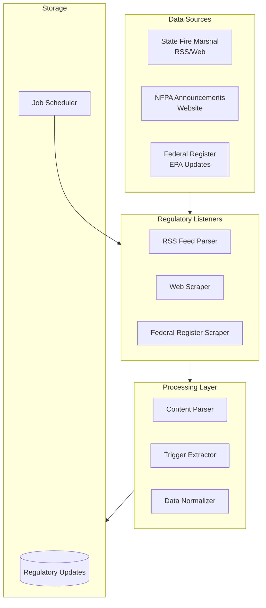

# Phase 1.2: Regulatory Listener Implementation Plan

## Overview

Phase 1.2 implements a regulatory monitoring system that tracks compliance triggers from multiple sources:
- State Fire Marshal bulletins (RSS feeds, websites)
- NFPA code amendment announcements
- EPA refrigerant phase-out schedules and HVAC regulations

These regulatory updates will be processed and stored separately from permit data, then used to identify compliance opportunities that can generate leads.

## Architecture



## Implementation Steps

### 1. Data Models

**File:** `src/signal_engine/models.py`

Create `RegulatoryUpdate` model to store regulatory information:

```python
class RegulatoryUpdate(BaseModel):
    update_id: str  # Unique identifier (e.g., hash of content + source)
    source: str  # "state_fire_marshal", "nfpa", "epa"
    source_name: str  # Human-readable source (e.g., "Texas State Fire Marshal")
    title: str
    content: str  # Full text or summary
    published_date: datetime
    effective_date: datetime | None
    url: str
    jurisdiction: str | None  # State, federal, etc.
    applicable_codes: list[str] = []  # NFPA codes, EPA regulations
    compliance_triggers: list[str] = []  # Extracted triggers
    building_types_affected: list[str] = []  # Building types impacted
    last_seen_at: datetime = Field(default_factory=datetime.utcnow)
```

### 2. RSS Feed Parser

**File:** `src/signal_engine/listeners/rss_parser.py` (new)

Implement RSS/Atom feed parser for state fire marshal bulletins:

- Use `feedparser` library (add to `pyproject.toml`)
- Parse RSS/Atom feeds
- Extract title, content, published date, links
- Handle feed updates (only process new items since last run)
- Support multiple feed formats

**Key Features:**
- Incremental updates (track last processed item)
- Error handling for malformed feeds
- Rate limiting for polite scraping

### 3. State Fire Marshal Listener

**File:** `src/signal_engine/listeners/fire_marshal_listener.py` (new)

Implement listener for state fire marshal bulletins:

- Start with 1-2 states (e.g., Texas, North Carolina)
- Support both RSS feeds and web scraping
- Extract compliance-relevant information
- Identify affected building types and codes

**Configuration:**
- State-specific feed URLs
- Parsing rules per state (if needed)
- Update frequency (daily/weekly)

### 4. NFPA Announcement Scraper

**File:** `src/signal_engine/listeners/nfpa_listener.py` (new)

Scrape NFPA.org for code amendment announcements:

- Monitor NFPA code update pages
- Extract code numbers (NFPA 72, NFPA 101, etc.)
- Parse amendment dates and effective dates
- Identify building types affected

**Implementation:**
- Use Playwright (reuse existing infrastructure)
- Parse HTML structure of NFPA announcement pages
- Extract structured data (code number, edition, effective date)

### 5. Federal Register / EPA Scraper

**File:** `src/signal_engine/listeners/epa_listener.py` (new)

Monitor Federal Register for EPA regulations:

- Focus on HVAC/refrigerant phase-out schedules
- Parse Federal Register entries
- Extract compliance deadlines
- Identify affected industries/building types

**Implementation:**
- Use Federal Register API or web scraping
- Filter for EPA-related regulations
- Extract phase-out schedules and deadlines

### 6. Base Regulatory Listener

**File:** `src/signal_engine/listeners/base_listener.py` (new)

Create base class for all regulatory listeners (similar to `BaseScraper`):

```python
class BaseRegulatoryListener(ABC):
    source: str
    
    @abstractmethod
    async def check_for_updates(self, last_run: datetime) -> list[RegulatoryUpdate]:
        """Check for new regulatory updates since last run."""
```

### 7. Content Processing

**File:** `src/signal_engine/listeners/content_processor.py` (new)

Process and extract compliance triggers from regulatory content:

- Use LLM (GPT-4o) to extract:
  - Applicable NFPA codes
  - Building types affected
  - Compliance deadlines
  - Key compliance triggers
- Cache processed results to avoid re-processing
- Handle rate limits and errors gracefully

### 8. Update Existing Regulatory Scraper

**File:** `src/signal_engine/scrapers/regulatory_scraper.py`

Refactor placeholder to use new listener infrastructure:

- Replace empty implementation
- Integrate with regulatory listeners
- Convert `RegulatoryUpdate` to `PermitData` if needed for compatibility
- Or keep separate and handle in enrichment pipeline

### 9. Scheduler Integration

**File:** `src/signal_engine/jobs/scraper_scheduler.py`

Add regulatory listeners to scheduler:

- Add methods to schedule regulatory listener jobs
- Configure update frequency (daily for RSS, weekly for web scraping)
- Store last run timestamps per listener
- Handle errors and retries

### 10. Storage/Persistence

**File:** `src/signal_engine/storage/regulatory_storage.py` (new)

Implement storage for regulatory updates:

**MVP Options:**
- **Option A:** JSON file storage (simple, matches current permit storage approach)
- **Option B:** SQLite database (better for querying, deduplication)
- **Option C:** Integration with existing Neo4j (store as nodes in knowledge graph)

**Recommendation:** Start with JSON file storage (consistent with Phase 1.1), add database later if needed.

**Features:**
- Deduplication by `update_id`
- Query by date range, source, jurisdiction
- Track processing status

### 11. Testing

**Files:**
- `scripts/test_regulatory_listeners.py` (new)
- `tests/fixtures/rss_feed.xml` (new)
- `tests/unit/test_rss_parser.py` (new)

Create comprehensive tests:
- RSS feed parsing
- Web scraping (NFPA, EPA)
- Content processing and trigger extraction
- Deduplication
- Scheduler integration

### 12. Configuration

**File:** `src/core/config.py`

Add configuration for regulatory listeners:

```python
# Regulatory listener settings
regulatory_rss_feeds: str = ""  # Comma-separated RSS feed URLs
regulatory_update_frequency_hours: int = 24
regulatory_llm_enabled: bool = True  # Use LLM for content processing
```

## File Structure

```
src/signal_engine/
├── listeners/
│   ├── __init__.py
│   ├── base_listener.py          # Base class for listeners
│   ├── rss_parser.py             # RSS/Atom feed parser
│   ├── fire_marshal_listener.py  # State fire marshal listener
│   ├── nfpa_listener.py          # NFPA announcement scraper
│   ├── epa_listener.py           # EPA/Federal Register scraper
│   └── content_processor.py     # LLM-based content processing
├── storage/
│   ├── __init__.py
│   └── regulatory_storage.py    # Storage for regulatory updates
└── models.py                     # Add RegulatoryUpdate model
```

## Dependencies

Add to `pyproject.toml`:
- `feedparser` - RSS/Atom feed parsing
- `beautifulsoup4` - HTML parsing (if not already present)
- `lxml` - XML/HTML parsing support

## Success Criteria

1. ✅ Can parse RSS feeds from state fire marshals
2. ✅ Can scrape NFPA code amendment announcements
3. ✅ Can monitor Federal Register for EPA updates
4. ✅ Extracts compliance triggers and applicable codes
5. ✅ Integrates with existing scheduler
6. ✅ Stores updates with deduplication
7. ✅ All components tested and working

## Implementation Order

1. Data models (`RegulatoryUpdate`)
2. RSS parser (foundation for state fire marshals)
3. Base listener class
4. State fire marshal listener (1-2 states)
5. NFPA listener
6. EPA listener
7. Content processor (LLM extraction)
8. Storage layer
9. Scheduler integration
10. Testing

## Notes

- Start with one source per type (1 state, NFPA, EPA) to prove the pattern
- LLM-based content processing can be expensive - consider caching and batching
- Some sources may require authentication or have rate limits - handle gracefully
- Regulatory updates may need to be linked to existing permits/leads in Phase 1.3

