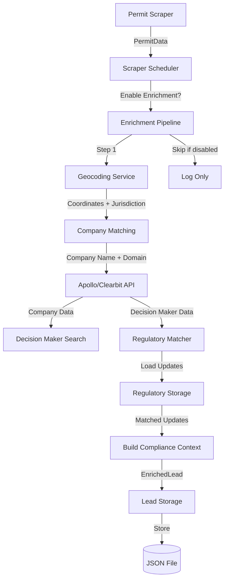

# Phase 1.3: Data Enrichment Pipeline Integration

## Overview

Complete the enrichment pipeline that transforms raw `PermitData` from scrapers into `EnrichedLead` records with company information, decision makers, and compliance context. This phase integrates geocoding, company matching, Apollo/Clearbit APIs, and regulatory update correlation.

## Current State

**What Exists:**
- Basic `ApolloClient` wrapper in `src/signal_engine/enrichment/apollo_client.py`
- Naive `enrich_permit_to_lead()` function in `src/signal_engine/enrichment/company_enricher.py` (uses applicant_name or placeholder)
- `EnrichedLead` model with `Company`, `DecisionMaker`, `PermitData`, and `ComplianceContext` fields
- API endpoint in `src/api/routes/leads.py` that calls enrichment
- Scraper scheduler in `src/signal_engine/jobs/scraper_scheduler.py` (currently just logs permits)

**What's Missing:**
- Geocoding service (address → coordinates → jurisdiction)
- Company matching logic (geocode → parcel/building owner → company domain)
- Enhanced Apollo integration with better search strategies
- Regulatory update correlation (match updates to permits by jurisdiction/building type/codes)
- Integration of enrichment into scraper scheduler workflow
- Storage/persistence layer for enriched leads

## Implementation Steps

### 1. Geocoding Service

**File:** `src/signal_engine/enrichment/geocoder.py` (new)

Create a geocoding service that:
- Takes an address string and returns coordinates (lat/lng)
- Optionally returns jurisdiction information (city, county, state)
- Uses a free geocoding API (e.g., Nominatim/OpenStreetMap) with fallback options
- Implements rate limiting and caching to avoid API limits
- Handles address normalization and parsing

**Key Functions:**
- `geocode_address(address: str) -> GeocodeResult` - Main geocoding function
- `GeocodeResult` model with: `latitude`, `longitude`, `formatted_address`, `city`, `county`, `state`, `country`

**Dependencies:**
- Use `httpx` with Nominatim API (free, no API key needed)
- Consider caching results in a simple JSON file or in-memory cache

### 2. Company Matching Enhancement

**File:** `src/signal_engine/enrichment/company_enricher.py` (modify)

Enhance the company matching logic:
- Use geocoding to get coordinates and jurisdiction
- Attempt to match company from:
  1. `applicant_name` from permit (if present and looks like company name)
  2. Building/parcel owner lookup (if geocoding provides parcel ID)
  3. Address-based company search (use Clearbit or Apollo company search by domain)
- Extract company domain from website if available
- Populate `Company` model with: `name`, `website`, `employee_count`, `revenue_estimate`, `industry`

**Enhancement Strategy:**
- If `applicant_name` exists and doesn't look like a person name → use as company name
- Use geocoded address to search for company at that location
- Use Apollo/Clearbit company search API to find company by name + location
- Fallback to placeholder if no match found

### 3. Enhanced Apollo/Clearbit Integration

**File:** `src/signal_engine/enrichment/apollo_client.py` (modify)

Enhance Apollo client with:
- Company search functionality (find company by name/domain/location)
- Better decision maker search with multiple strategies:
  - Search by company name + location + titles
  - Search by company domain + titles
  - Fallback to broader title searches if specific search fails
- Add Clearbit integration as alternative/fallback (if API key available)
- Implement result ranking/scoring (prefer exact title matches, verified emails)

**New Methods:**
- `find_company(company_name: str, location: str | None = None) -> ApolloCompany | None`
- `find_decision_makers_enhanced(...)` - Multi-strategy search

### 4. Decision Maker Identification Logic

**File:** `src/signal_engine/enrichment/company_enricher.py` (modify)

Implement smart decision maker identification:
- Use enhanced Apollo search with facility/building-related titles
- Rank results by:
  1. Title relevance (Facility Director > Facilities Manager > Building Engineer)
  2. Email verification status
  3. Location match (prefer local decision makers)
- Select best match or return top 3 candidates
- Populate `DecisionMaker` model with best match

**Title Priority List:**
- Facility Director, Facilities Director, Director of Facilities
- Facilities Manager, Building Manager
- Chief Engineer, Building Engineer
- Property Manager (if no facility-specific titles found)

### 5. Regulatory Update Correlation

**File:** `src/signal_engine/enrichment/regulatory_matcher.py` (new)

Create a service that matches regulatory updates to permits:
- Load regulatory updates from storage (`RegulatoryStorage`)
- Match criteria:
  1. **Jurisdiction match**: Permit location matches update jurisdiction
  2. **Building type match**: Permit `building_type` in update's `building_types_affected`
  3. **Code match**: Permit type or codes match update's `applicable_codes`
  4. **Date relevance**: Update published/effective date is recent (within last 6 months)
- Return list of relevant `RegulatoryUpdate` objects for a permit

**Integration:**
- Call from `enrich_permit_to_lead()` to populate `ComplianceContext.triggers`
- Store matched update IDs in `ComplianceContext` for reference

### 6. Enhanced Enrichment Pipeline

**File:** `src/signal_engine/enrichment/company_enricher.py` (major refactor)

Refactor `enrich_permit_to_lead()` to implement full pipeline:

```python
async def enrich_permit_to_lead(inputs: EnrichmentInputs) -> EnrichedLead:
    # Step 1: Geocode address
    geocode_result = await geocode_address(inputs.permit.address)
    
    # Step 2: Match company (enhanced logic)
    company = await match_company(inputs.permit, geocode_result)
    
    # Step 3: Find decision maker (enhanced Apollo search)
    decision_maker = await find_decision_maker(company, geocode_result)
    
    # Step 4: Match regulatory updates
    regulatory_matches = await match_regulatory_updates(inputs.permit, geocode_result)
    compliance_context = build_compliance_context(regulatory_matches, geocode_result)
    
    # Step 5: Build enriched lead
    return EnrichedLead(...)
```

**New Helper Functions:**
- `match_company(permit, geocode_result) -> Company`
- `find_decision_maker(company, geocode_result) -> DecisionMaker | None`
- `match_regulatory_updates(permit, geocode_result) -> list[RegulatoryUpdate]`
- `build_compliance_context(updates, geocode_result) -> ComplianceContext`

### 7. Scraper Scheduler Integration

**File:** `src/signal_engine/jobs/scraper_scheduler.py` (modify)

Integrate enrichment into scraper workflow:
- After scraping permits, automatically enrich each permit
- Store enriched leads (use simple JSON storage for MVP, similar to regulatory storage)
- Add configuration option to enable/disable enrichment (for cost control)
- Log enrichment results and failures

**Modify `run_scraper_job()` method:**
```python
async def run_scraper_job(...):
    # ... existing scraper logic ...
    
    if permits:
        # Enrich permits (if enabled)
        if self.settings.enable_enrichment:
            enriched_leads = await self._enrich_permits(permits, tenant_id)
            await self._store_enriched_leads(enriched_leads, tenant_id)
        
        logger.info(f"Enriched {len(enriched_leads)} leads from {len(permits)} permits")
```

### 8. Enriched Lead Storage

**File:** `src/signal_engine/storage/lead_storage.py` (new)

Create storage layer for enriched leads (similar to `RegulatoryStorage`):
- JSON file storage: `data/enriched_leads.json`
- Deduplication by `lead_id`
- Query methods: `get_by_tenant()`, `get_by_permit_id()`, `get_recent()`
- Update methods: `save_lead()`, `save_leads()`

**Schema:**
- Store `EnrichedLead` objects as JSON
- Index by `tenant_id` and `permit.permit_id` for lookups

### 9. Configuration Updates

**File:** `src/core/config.py` (modify)

Add enrichment-related settings:
- `enable_enrichment: bool = True` - Master switch for enrichment
- `geocoding_provider: str = "nominatim"` - Geocoding service choice
- `apollo_api_key: str | None = None` - Apollo API key
- `clearbit_api_key: str | None = None` - Clearbit API key (optional)
- `enrichment_cache_enabled: bool = True` - Enable geocoding/company caching

### 10. Testing & Validation

**File:** `scripts/test_enrichment_pipeline.py` (new)

Create comprehensive test script:
- Test geocoding with real addresses from permits
- Test company matching with known companies
- Test decision maker identification
- Test regulatory update matching
- Test end-to-end enrichment flow
- Validate enriched lead data quality

**File:** `tests/unit/test_enrichment.py` (enhance)

Add unit tests for:
- Geocoding service (mock API responses)
- Company matching logic
- Decision maker identification
- Regulatory update matching
- Full enrichment pipeline

## Data Flow



## Implementation Order

1. **Geocoding Service** - Foundation for location-based matching
2. **Company Matching Enhancement** - Core enrichment logic
3. **Enhanced Apollo Integration** - Better decision maker discovery
4. **Regulatory Update Correlation** - Connect Phase 1.2 to Phase 1.3
5. **Enhanced Enrichment Pipeline** - Integrate all components
6. **Scraper Scheduler Integration** - Automate enrichment workflow
7. **Lead Storage** - Persistence layer
8. **Configuration & Testing** - Polish and validate

## Success Criteria

- ✅ Geocoding successfully converts permit addresses to coordinates + jurisdiction
- ✅ Company matching achieves >60% match rate on real permit data
- ✅ Decision maker identification finds contacts for >50% of matched companies
- ✅ Regulatory updates are correctly matched to permits by jurisdiction/building type
- ✅ Enrichment pipeline runs automatically after scraper jobs
- ✅ Enriched leads are stored and queryable
- ✅ All components have error handling and fallbacks
- ✅ Test suite validates end-to-end enrichment flow

## Dependencies to Add

Add to `pyproject.toml`:
- `geopy = "^2.4.0"` - Geocoding library (or use Nominatim via httpx)

## Environment Variables

Add to `.env.example`:
- `ENABLE_ENRICHMENT=true`
- `GEOCODING_PROVIDER=nominatim`
- `APOLLO_API_KEY=...` (already exists)
- `CLEARBIT_API_KEY=...` (optional)
- `ENRICHMENT_CACHE_ENABLED=true`

## Files to Create/Modify

**New Files:**
- `src/signal_engine/enrichment/geocoder.py`
- `src/signal_engine/enrichment/regulatory_matcher.py`
- `src/signal_engine/storage/lead_storage.py`
- `scripts/test_enrichment_pipeline.py`

**Modified Files:**
- `src/signal_engine/enrichment/company_enricher.py` (major refactor)
- `src/signal_engine/enrichment/apollo_client.py` (enhancements)
- `src/signal_engine/jobs/scraper_scheduler.py` (integration)
- `src/core/config.py` (new settings)
- `tests/unit/test_enrichment.py` (expand tests)
- `pyproject.toml` (add dependencies)

## Notes

- Use free geocoding services (Nominatim) for MVP to avoid API costs
- Implement caching aggressively to reduce API calls
- Make enrichment optional/configurable to control costs
- Handle API failures gracefully with fallbacks
- Store enriched leads in JSON for MVP (can upgrade to database later)
- Regulatory matching should be fuzzy (partial matches are OK)

