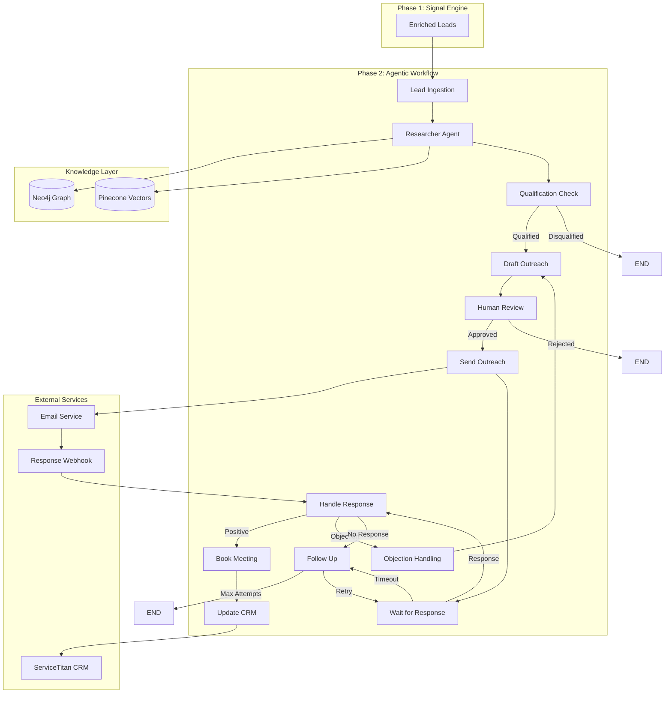
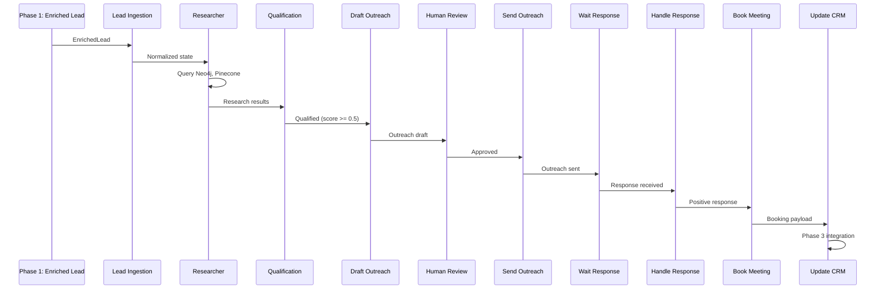

# Phase 2: Agentic Workflow Implementation Plan

## Overview

Phase 2 implements the complete multi-agent LangGraph workflow that processes enriched leads from Phase 1 through research, qualification, outreach generation, human approval, response handling, objection management, and CRM booking preparation. This phase transforms the Signal Engine's enriched leads into actionable outreach and appointment bookings.

## Phase 2 Sub-Phases Summary

Following the Phase 1 pattern (1.1, 1.2, 1.3), Phase 2 is organized into four logical sub-phases:

| Sub-Phase | Name | Focus | Key Deliverables |
|-----------|------|-------|------------------|
| **2.1** | Core Workflow & Outreach Generation | Complete basic workflow from lead to outreach delivery | Working workflow that processes leads and sends outreach |
| **2.2** | Response Handling & Classification | Handle and classify responses | System can receive, track, and classify responses |
| **2.3** | Follow-ups & Objection Management | Manage follow-ups and objections | Complete response management with booking prep |
| **2.4** | Testing & Monitoring | Validate and observe workflow | Fully tested and monitored system |

**Progress Tracking:**
- Phase 2.1: ⏳ Pending
- Phase 2.2: ⏳ Pending
- Phase 2.3: ⏳ Pending
- Phase 2.4: ⏳ Pending

## Current State Assessment

### ✅ What Exists

**Core Infrastructure:**
- ✅ LangGraph orchestrator structure (`src/agents/orchestrator.py`)
- ✅ Agent state schema (`src/agents/state.py`) - `AOROState` TypedDict
- ✅ Basic workflow graph with nodes: LeadIngestion, Research, QualificationCheck, DraftOutreach, HumanReview, SendOutreach
- ✅ Agent nodes implemented:
  - ✅ Researcher node (`src/agents/nodes/researcher.py`) - Queries Neo4j, searches Pinecone
  - ✅ Communicator node (`src/agents/nodes/communicator.py`) - Generates outreach drafts
  - ✅ Closer node (`src/agents/nodes/closer.py`) - Handles objections
  - ✅ Human Review node (`src/agents/nodes/human_review.py`) - HITL approval gates
- ✅ Agent tools:
  - ✅ Regulatory lookup (`src/agents/tools/regulatory_lookup.py`) - Neo4j fire code queries
  - ✅ Case study search (`src/agents/tools/case_study_search.py`) - Pinecone semantic search
- ✅ Observability integration (`src/core/observability.py`) - LangSmith tracing

**Workflow Flow (Current):**
```
START → LeadIngestion → Research → QualificationCheck → [Disqualified/END | DraftOutreach] 
→ HumanReview → [SendOutreach | END] → END
```

### ⚠️ What's Missing

**Missing Workflow Nodes:**
- ❌ WaitForResponse - Monitor for responses with timeout
- ❌ HandleResponse - Classify and route responses
- ❌ FollowUp - Automated follow-up sequences
- ❌ BookMeeting - Prepare meeting booking data
- ❌ UpdateCRM - CRM integration (Phase 3 prep)

**Missing Features:**
- ❌ Response tracking and persistence
- ❌ Email sending infrastructure
- ❌ Workflow state persistence (resume interrupted workflows)
- ❌ Response classification (positive, objection, no-response)
- ❌ Follow-up scheduling and max attempts logic
- ❌ ObjectionHandling node routing (exists but not connected)
- ❌ Compliance urgency scoring in Researcher
- ❌ Multi-channel support (currently email-only)

**Integration Gaps:**
- ❌ Connection to Phase 1 enriched leads
- ❌ Email service integration (SendGrid, AWS SES, etc.)
- ❌ Response webhook handling
- ❌ CRM booking preparation (Phase 3 prep)

## Architecture



## Implementation Steps

### 1. Response Tracking & Persistence

**File:** `src/agents/storage/workflow_storage.py` (new)

Create storage layer for workflow state and responses:
- Store workflow state snapshots for persistence
- Track outreach messages sent (timestamp, channel, content)
- Track responses received (timestamp, content, classification)
- Store follow-up schedules and attempts
- Enable workflow resumption from checkpoints

**Key Functions:**
- `save_workflow_state(lead_id: str, state: AOROState) -> None`
- `load_workflow_state(lead_id: str) -> AOROState | None`
- `save_outreach(lead_id: str, outreach: dict) -> None`
- `save_response(lead_id: str, response: dict) -> None`
- `get_followup_schedule(lead_id: str) -> dict | None`

**Storage Options:**
- **MVP:** JSON file storage (`data/workflow_states.json`)
- **Future:** Database (PostgreSQL/Neo4j) for production

### 2. WaitForResponse Node

**File:** `src/agents/nodes/wait_response.py` (new)

Create node that waits for responses with timeout handling:
- Set timeout period (e.g., 7 days for email)
- Check for responses periodically (via webhook or polling)
- Handle timeout by routing to FollowUp
- Handle response received by routing to HandleResponse

**Implementation:**
```python
async def wait_response_node(state: AOROState) -> AOROState:
    """
    Wait for response with timeout. Check for responses via webhook/polling.
    """
    lead_id = state.get("lead_id")
    outreach_sent_at = state.get("outreach_sent_at")
    timeout_days = 7
    
    # Check if response received
    response = await check_for_response(lead_id)
    if response:
        return {**state, "response_received": True, "response_data": response}
    
    # Check if timeout
    if outreach_sent_at and (datetime.now() - outreach_sent_at).days >= timeout_days:
        return {**state, "response_timeout": True}
    
    # Still waiting - interrupt and resume later
    from langgraph.prebuilt import interrupt
    interrupt({"type": "waiting_for_response", "lead_id": lead_id})
    return state
```

**Integration:**
- Connect to response webhook endpoint
- Poll email service for replies (if supported)
- Store wait state for resumption

### 3. HandleResponse Node

**File:** `src/agents/nodes/handle_response.py` (new)

Create node that classifies and routes responses:
- Classify response type: positive, objection, no-response, unsubscribe
- Extract key information (interest level, concerns, objections)
- Route to appropriate next node:
  - Positive → BookMeeting
  - Objection → ObjectionHandling
  - No response → FollowUp (if within retry window)

**Implementation:**
```python
async def handle_response_node(state: AOROState) -> AOROState:
    """
    Classify response and route to appropriate handler.
    """
    response_data = state.get("response_data") or {}
    response_text = response_data.get("content", "")
    
    # Classify using LLM
    classification = await classify_response(response_text, state)
    
    # Update state with classification
    return {
        **state,
        "response_classification": classification["type"],
        "response_sentiment": classification["sentiment"],
        "extracted_objections": classification.get("objections", []),
        "current_objection": classification.get("primary_objection"),
    }
```

**Response Classification:**
- **Positive:** Interest expressed, questions about services, scheduling requests
- **Objection:** Price concerns, timing issues, not interested, already have vendor
- **No Response:** Empty or acknowledgment-only responses
- **Unsubscribe:** Explicit opt-out requests

### 4. FollowUp Node

**File:** `src/agents/nodes/followup.py` (new)

Create node for automated follow-up sequences:
- Track follow-up attempts (max 2-3 attempts)
- Schedule follow-ups with increasing intervals (3 days, 7 days)
- Generate follow-up messages (different from initial outreach)
- Route back to WaitForResponse or end if max attempts reached

**Implementation:**
```python
async def followup_node(state: AOROState) -> AOROState:
    """
    Schedule and send follow-up outreach.
    """
    followup_count = state.get("followup_count", 0)
    max_followups = 2
    
    if followup_count >= max_followups:
        return {**state, "workflow_complete": True, "status": "no_response"}
    
    # Generate follow-up message
    followup_draft = await generate_followup_message(state)
    
    # Schedule follow-up (store for later execution)
    followup_scheduled_at = datetime.now() + timedelta(days=3 * (followup_count + 1))
    
    return {
        **state,
        "followup_count": followup_count + 1,
        "outreach_draft": followup_draft,
        "followup_scheduled_at": followup_scheduled_at,
    }
```

**Follow-up Strategy:**
- **First follow-up (3 days):** Gentle reminder, add value (case study, code update)
- **Second follow-up (7 days):** Final attempt, soft close
- **After max attempts:** Mark as "no_response" and end workflow

### 5. ObjectionHandling Node Integration

**File:** `src/agents/orchestrator.py` (modify)

Connect existing ObjectionHandling node to workflow:
- Route from HandleResponse when objection detected
- After handling objection, route back to DraftOutreach (revised message)
- Limit objection handling loops (max 2-3 cycles)

**Routing Logic:**
```python
def route_after_response(state: AOROState) -> str:
    classification = state.get("response_classification")
    
    if classification == "positive":
        return "BookMeeting"
    elif classification == "objection":
        return "ObjectionHandling"
    elif classification == "no_response":
        return "FollowUp"
    else:
        return END
```

### 6. BookMeeting Node

**File:** `src/agents/nodes/book_meeting.py` (new)

Create node that prepares meeting booking data:
- Extract preferred meeting times from response
- Prepare booking payload for CRM (Phase 3 integration)
- Store booking request in state
- Route to UpdateCRM node

**Implementation:**
```python
async def book_meeting_node(state: AOROState) -> AOROState:
    """
    Prepare meeting booking data for CRM integration.
    """
    response_data = state.get("response_data") or {}
    decision_maker = state.get("decision_maker") or {}
    permit = state.get("permit_data") or {}
    
    # Extract meeting preferences from response
    meeting_preferences = await extract_meeting_preferences(response_data.get("content", ""))
    
    # Prepare booking payload
    booking_payload = {
        "lead_id": state.get("lead_id"),
        "company_name": state.get("company_name"),
        "decision_maker": decision_maker,
        "permit_data": permit,
        "preferred_times": meeting_preferences.get("times", []),
        "meeting_type": "consultation",
        "notes": f"Generated from permit: {permit.get('permit_id')}",
    }
    
    return {
        **state,
        "booking_payload": booking_payload,
        "booking_ready": True,
    }
```

**Note:** Actual CRM booking happens in Phase 3 (UpdateCRM node). This node prepares the data.

### 7. UpdateCRM Node

**File:** `src/agents/nodes/update_crm.py` (new)

Create placeholder node for Phase 3 CRM integration:
- Prepare for ServiceTitan MCP integration
- Store booking request in state
- Log booking attempt
- For MVP: Mark as "ready_for_crm" and end workflow

**Implementation:**
```python
async def update_crm_node(state: AOROState) -> AOROState:
    """
    Update CRM with booking (Phase 3 integration placeholder).
    """
    booking_payload = state.get("booking_payload")
    
    # Phase 3: Call MCP tool to create booking
    # For now: Log and mark as ready
    logger.info(f"Booking ready for CRM: {state.get('lead_id')}")
    
    return {
        **state,
        "crm_booking_id": None,  # Will be set in Phase 3
        "workflow_complete": True,
        "status": "booking_ready",
    }
```

### 8. Email Sending Infrastructure

**File:** `src/agents/infrastructure/email_sender.py` (new)

Create email sending service:
- Support for email service providers (SendGrid, AWS SES, SMTP)
- Template rendering for outreach messages
- Tracking (open rates, click rates if supported)
- Error handling and retries

**Implementation Options:**
- **Option A:** SendGrid API (recommended for MVP)
- **Option B:** AWS SES (cost-effective, scalable)
- **Option C:** SMTP (simple, but limited tracking)

**Key Functions:**
- `send_outreach_email(lead_id: str, to: str, subject: str, body: str) -> dict`
- `track_email_status(email_id: str) -> dict`

### 9. Response Webhook Handler

**File:** `src/api/routes/webhooks.py` (modify)

Add webhook endpoint for receiving responses:
- Receive email replies (via SendGrid webhook, AWS SES SNS, etc.)
- Parse response content
- Update workflow state
- Trigger workflow resumption

**Implementation:**
```python
@router.post("/webhooks/email-response")
async def handle_email_response(request: Request):
    """
    Webhook endpoint for email service to notify about responses.
    """
    payload = await request.json()
    lead_id = extract_lead_id_from_email(payload)
    response_content = extract_response_content(payload)
    
    # Update workflow state
    await save_response(lead_id, {
        "content": response_content,
        "received_at": datetime.now(),
        "source": "email",
    })
    
    # Resume workflow if waiting
    await resume_workflow(lead_id)
    
    return {"status": "received"}
```

### 10. Workflow State Persistence

**File:** `src/agents/orchestrator.py` (modify)

Add persistence to workflow:
- Save state after each node execution
- Enable workflow resumption from checkpoints
- Handle interruptions gracefully
- Support long-running workflows (waiting for responses)

**Integration:**
- Use LangGraph's checkpointing features
- Store checkpoints in workflow storage
- Resume from last checkpoint on restart

### 11. Researcher Node Enhancement

**File:** `src/agents/nodes/researcher.py` (modify)

Enhance Researcher node with compliance urgency scoring:
- Calculate urgency score based on:
  - Permit status (issued, inspection scheduled)
  - Regulatory update recency
  - Building type risk level
  - Code compliance gaps
- Add urgency score to state for qualification

**Implementation:**
```python
async def calculate_compliance_urgency(state: AOROState) -> float:
    """
    Calculate compliance urgency score (0.0 - 1.0).
    """
    permit = state.get("permit_data") or {}
    status = str(permit.get("status", "")).lower()
    codes = state.get("applicable_codes") or []
    gaps = state.get("compliance_gaps") or []
    
    score = 0.0
    
    # Status-based urgency
    if "inspection" in status or "scheduled" in status:
        score += 0.4
    elif "issued" in status:
        score += 0.2
    
    # Code-based urgency
    if len(codes) > 0:
        score += 0.2
    
    # Gap-based urgency
    if len(gaps) > 0:
        score += 0.2
    
    # Regulatory update recency (if available)
    # Add logic to check for recent regulatory updates
    
    return min(score, 1.0)
```

### 12. Communicator Node Enhancement

**File:** `src/agents/nodes/communicator.py` (modify)

Enhance Communicator node with multi-channel support:
- Support email, WhatsApp, voice (future)
- Channel-specific message formatting
- Adaptive tone based on channel
- Template selection by channel

**Implementation:**
```python
async def communicator_node(state: AOROState) -> AOROState:
    """
    Generate outreach for specified channel.
    """
    channel = state.get("outreach_channel", "email")
    
    if channel == "email":
        draft = await generate_email_outreach(state)
    elif channel == "whatsapp":
        draft = await generate_whatsapp_outreach(state)
    elif channel == "voice":
        draft = await generate_voice_script(state)
    else:
        draft = await generate_email_outreach(state)  # Default
    
    return {**state, "outreach_draft": draft, "outreach_channel": channel}
```

### 13. Complete Workflow Graph

**File:** `src/agents/orchestrator.py` (major refactor)

Complete the workflow graph with all nodes and routing:

```python
def build_graph():
    graph = StateGraph(AOROState)
    
    # Add all nodes
    graph.add_node("LeadIngestion", lead_ingestion_node)
    graph.add_node("Research", researcher_node)
    graph.add_node("QualificationCheck", qualification_check_node)
    graph.add_node("DraftOutreach", communicator_node)
    graph.add_node("HumanReview", human_review_node)
    graph.add_node("SendOutreach", send_outreach_node)
    graph.add_node("WaitForResponse", wait_response_node)
    graph.add_node("HandleResponse", handle_response_node)
    graph.add_node("FollowUp", followup_node)
    graph.add_node("ObjectionHandling", closer_node)
    graph.add_node("BookMeeting", book_meeting_node)
    graph.add_node("UpdateCRM", update_crm_node)
    
    # Define edges
    graph.add_edge(START, "LeadIngestion")
    graph.add_edge("LeadIngestion", "Research")
    graph.add_edge("Research", "QualificationCheck")
    
    # Qualification routing
    graph.add_conditional_edges(
        "QualificationCheck",
        route_after_qualification,
        {
            END: END,
            "DraftOutreach": "DraftOutreach",
        }
    )
    
    graph.add_edge("DraftOutreach", "HumanReview")
    
    # Human review routing
    graph.add_conditional_edges(
        "HumanReview",
        route_after_review,
        {
            "SendOutreach": "SendOutreach",
            END: END,
        }
    )
    
    graph.add_edge("SendOutreach", "WaitForResponse")
    
    # Wait for response routing
    graph.add_conditional_edges(
        "WaitForResponse",
        route_after_wait,
        {
            "HandleResponse": "HandleResponse",
            "FollowUp": "FollowUp",
            END: END,
        }
    )
    
    # Handle response routing
    graph.add_conditional_edges(
        "HandleResponse",
        route_after_response,
        {
            "BookMeeting": "BookMeeting",
            "ObjectionHandling": "ObjectionHandling",
            "FollowUp": "FollowUp",
            END: END,
        }
    )
    
    # Objection handling routing
    graph.add_edge("ObjectionHandling", "DraftOutreach")
    
    # Follow-up routing
    graph.add_conditional_edges(
        "FollowUp",
        route_after_followup,
        {
            "WaitForResponse": "WaitForResponse",
            END: END,
        }
    )
    
    graph.add_edge("BookMeeting", "UpdateCRM")
    graph.add_edge("UpdateCRM", END)
    
    return graph.compile()
```

### 14. End-to-End Testing

**File:** `scripts/phase2/test_workflow_e2e.py` (new)

Create comprehensive end-to-end tests:
- Test full workflow with real enriched leads
- Test each routing path (qualified, disqualified, approved, rejected)
- Test response handling (positive, objection, no-response)
- Test follow-up sequences
- Test objection handling loops
- Test workflow persistence and resumption

**Test Scenarios:**
1. **Happy Path:** Qualified lead → Approved → Positive response → Booking
2. **Objection Path:** Qualified lead → Approved → Objection → Handling → Revised outreach
3. **No Response Path:** Qualified lead → Approved → No response → Follow-up → Still no response → End
4. **Disqualified Path:** Low score → Disqualified → End
5. **Rejected Path:** Draft → Human rejection → End

### 15. Workflow Monitoring & Observability

**File:** `src/agents/monitoring.py` (new)

Add workflow monitoring:
- Track workflow execution times
- Monitor node success/failure rates
- Track response rates and conversion metrics
- Alert on workflow failures
- Dashboard for workflow status

**Metrics to Track:**
- Lead qualification rate
- Human approval rate
- Response rate
- Positive response rate
- Booking conversion rate
- Average time to response
- Average time to booking

## Data Flow



## Phase 2 Sub-Phases Detailed Breakdown

### Phase 2.1: Core Workflow & Outreach Generation

**Goal:** Complete the core workflow from lead ingestion through outreach delivery

**Status:** ⏳ Pending

**Components:**
1. **Researcher Node Enhancement**
   - Add compliance urgency scoring
   - Calculate urgency based on permit status, regulatory updates, building type
   - Enhance research quality

2. **Communicator Node Enhancement**
   - Add multi-channel support (email, WhatsApp, voice)
   - Channel-specific message formatting
   - Adaptive tone based on channel

3. **Workflow State Persistence**
   - Implement checkpointing for workflow state
   - Enable workflow resumption from interruptions
   - Store state snapshots

4. **Email Sending Infrastructure**
   - Integrate email service (SendGrid, AWS SES, or SMTP)
   - Template rendering
   - Email tracking (if supported)
   - Error handling and retries

5. **Complete Workflow Graph (Basic Flow)**
   - Connect nodes: LeadIngestion → Research → Qualification → Draft → Review → Send
   - Implement routing logic
   - Handle disqualified leads

**Success Criteria:**
- ✅ Workflow processes enriched leads from Phase 1
- ✅ Researcher queries Neo4j and Pinecone successfully
- ✅ Communicator generates personalized outreach
- ✅ Human review gates work correctly
- ✅ Outreach is sent via email
- ✅ Workflow state persists correctly

**Files to Create/Modify:**
- `src/agents/nodes/researcher.py` (enhance)
- `src/agents/nodes/communicator.py` (enhance)
- `src/agents/infrastructure/email_sender.py` (new)
- `src/agents/orchestrator.py` (complete basic flow)
- `src/agents/storage/workflow_storage.py` (new)

---

### Phase 2.2: Response Handling & Classification

**Goal:** Handle responses, classify them, and route appropriately

**Status:** ⏳ Pending

**Components:**
1. **Response Tracking & Persistence**
   - Store outreach messages sent
   - Track responses received
   - Store follow-up schedules
   - Enable workflow resumption

2. **Response Webhook Handler**
   - Webhook endpoint for email service
   - Parse response content
   - Update workflow state
   - Trigger workflow resumption

3. **WaitForResponse Node**
   - Monitor for responses with timeout
   - Check for responses periodically
   - Handle timeout routing
   - Handle response received routing

4. **HandleResponse Node**
   - Classify response type (positive, objection, no-response)
   - Extract key information
   - Route to appropriate handler

**Success Criteria:**
- ✅ Responses are tracked and stored
- ✅ Webhook receives responses correctly
- ✅ WaitForResponse handles timeouts
- ✅ HandleResponse classifies responses accurately
- ✅ Routing works for all response types

**Files to Create/Modify:**
- `src/agents/storage/workflow_storage.py` (enhance)
- `src/agents/nodes/wait_response.py` (new)
- `src/agents/nodes/handle_response.py` (new)
- `src/api/routes/webhooks.py` (modify)
- `src/agents/orchestrator.py` (add response handling nodes)

---

### Phase 2.3: Follow-ups & Objection Management

**Goal:** Manage follow-up sequences and handle objections

**Status:** ⏳ Pending

**Components:**
1. **FollowUp Node**
   - Track follow-up attempts (max 2-3)
   - Schedule follow-ups with intervals
   - Generate follow-up messages
   - Route back to WaitForResponse or end

2. **ObjectionHandling Integration**
   - Connect existing closer node to workflow
   - Route from HandleResponse when objection detected
   - Route back to DraftOutreach after handling
   - Limit objection handling loops

3. **BookMeeting Node**
   - Extract meeting preferences from response
   - Prepare booking payload for CRM
   - Store booking request in state
   - Route to UpdateCRM node

4. **UpdateCRM Node**
   - Placeholder for Phase 3 CRM integration
   - Prepare for ServiceTitan MCP integration
   - Store booking request
   - Mark as ready for CRM

**Success Criteria:**
- ✅ Follow-up sequences execute correctly
- ✅ Max attempt limits are enforced
- ✅ Objection handling routes correctly
- ✅ Booking data is prepared for Phase 3
- ✅ All routing paths work correctly

**Files to Create/Modify:**
- `src/agents/nodes/followup.py` (new)
- `src/agents/nodes/book_meeting.py` (new)
- `src/agents/nodes/update_crm.py` (new)
- `src/agents/orchestrator.py` (complete full workflow)
- `src/agents/nodes/closer.py` (verify integration)

---

### Phase 2.4: Testing & Monitoring

**Goal:** Validate end-to-end workflow and add observability

**Status:** ⏳ Pending

**Components:**
1. **End-to-End Testing**
   - Test full workflow with real enriched leads
   - Test each routing path
   - Test response handling scenarios
   - Test follow-up sequences
   - Test objection handling loops
   - Test workflow persistence

2. **Workflow Monitoring & Observability**
   - Track workflow execution times
   - Monitor node success/failure rates
   - Track response rates and conversion metrics
   - Alert on workflow failures
   - Dashboard for workflow status

**Success Criteria:**
- ✅ All test scenarios pass
- ✅ Workflow metrics are tracked
- ✅ Monitoring provides visibility
- ✅ Performance is acceptable
- ✅ Error handling works correctly

**Files to Create/Modify:**
- `scripts/phase2/test_workflow_e2e.py` (new)
- `src/agents/monitoring.py` (new)
- `tests/unit/test_workflow.py` (new)
- `docs/ai/PHASE_2_COMPLETE.md` (new - completion doc)

## Implementation Order by Sub-Phase

### Phase 2.1: Core Workflow & Outreach Generation

1. **Researcher Enhancement** - Compliance urgency scoring
2. **Communicator Enhancement** - Multi-channel support
3. **Workflow State Persistence** - Enable resumption
4. **Email Sending Infrastructure** - Actual outreach delivery
5. **Complete Workflow Graph** - Connect all nodes (basic flow: Ingestion → Research → Qualification → Draft → Review → Send)

### Phase 2.2: Response Handling & Classification

6. **Response Tracking & Persistence** - Foundation for response handling
7. **Response Webhook Handler** - Receive responses
8. **WaitForResponse Node** - Core response waiting logic
9. **HandleResponse Node** - Response classification and routing

### Phase 2.3: Follow-ups & Objection Management

10. **FollowUp Node** - Follow-up sequence logic
11. **ObjectionHandling Integration** - Connect existing node to workflow
12. **BookMeeting Node** - Prepare booking data
13. **UpdateCRM Node** - Phase 3 placeholder

### Phase 2.4: Testing & Monitoring

14. **End-to-End Testing** - Validate full workflow
15. **Workflow Monitoring** - Observability and metrics

## Success Criteria

- ✅ Workflow processes enriched leads from Phase 1 end-to-end
- ✅ Researcher node queries Neo4j and Pinecone successfully
- ✅ Qualification scoring accurately filters leads
- ✅ Communicator generates personalized outreach drafts
- ✅ Human review gates work with auto-approval and interrupts
- ✅ Outreach is sent via email (or configured channel)
- ✅ Response tracking captures and classifies responses
- ✅ Follow-up sequences execute with max attempt limits
- ✅ Objection handling routes back to revised outreach
- ✅ Booking data is prepared for Phase 3 CRM integration
- ✅ Workflow state persists and can be resumed
- ✅ All routing paths tested and working
- ✅ End-to-end tests pass with real enriched leads
- ✅ Workflow monitoring provides visibility into execution

## Dependencies to Add

Add to `pyproject.toml`:
- `sendgrid` - Email sending (or `boto3` for AWS SES)
- `langgraph-checkpoint` - Workflow persistence (if using LangGraph checkpoints)

## Environment Variables

Add to `.env.example`:
- `EMAIL_PROVIDER=sendgrid` (or `ses`, `smtp`)
- `SENDGRID_API_KEY=...` (if using SendGrid)
- `AWS_SES_REGION=...` (if using AWS SES)
- `SMTP_HOST=...` (if using SMTP)
- `WORKFLOW_PERSISTENCE_ENABLED=true`
- `MAX_FOLLOWUP_ATTEMPTS=2`
- `RESPONSE_TIMEOUT_DAYS=7`

## Files to Create/Modify

**New Files:**
- `src/agents/storage/workflow_storage.py`
- `src/agents/nodes/wait_response.py`
- `src/agents/nodes/handle_response.py`
- `src/agents/nodes/followup.py`
- `src/agents/nodes/book_meeting.py`
- `src/agents/nodes/update_crm.py`
- `src/agents/infrastructure/email_sender.py`
- `src/agents/monitoring.py`
- `scripts/phase2/test_workflow_e2e.py`

**Modified Files:**
- `src/agents/orchestrator.py` (major refactor - complete workflow)
- `src/agents/nodes/researcher.py` (add urgency scoring)
- `src/agents/nodes/communicator.py` (multi-channel support)
- `src/api/routes/webhooks.py` (response webhook handler)
- `src/core/config.py` (workflow settings)
- `pyproject.toml` (add dependencies)

## Integration Points

**Phase 1 Integration:**
- Accept `EnrichedLead` objects from Phase 1.3
- Use company, decision maker, permit data from enrichment
- Leverage regulatory matches from Phase 1.2

**Phase 3 Preparation:**
- BookMeeting node prepares booking payload
- UpdateCRM node ready for MCP integration
- State includes CRM booking fields

**Knowledge Layer Integration:**
- Researcher uses Neo4j for fire codes
- Researcher uses Pinecone for case studies
- Tools already integrated

## Notes

- Start with email-only for MVP, add WhatsApp/voice later
- Use simple JSON storage for workflow state in MVP
- Response classification can be improved with fine-tuning
- Follow-up intervals can be tuned based on response rates
- Objection handling loops should have max cycles to prevent infinite loops
- Workflow persistence is critical for long-running workflows (waiting for responses)
- Email sending should have retry logic and error handling
- Webhook security: validate webhook signatures from email service
- Consider rate limiting for email sending to avoid spam filters
